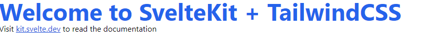

# Svelte Kit + TailwindCSS Starter template

* Uses the latest TailwindCSS version (v3.0.5)
* Default Svelte TypeScript config
* Default Svelte ESLint config
* Default Svelte Prettier config

## Running the template
To start the app run `npm run dev` in your console and open up `http://localhost:3000` in your browser. If you see the following everything worked:

